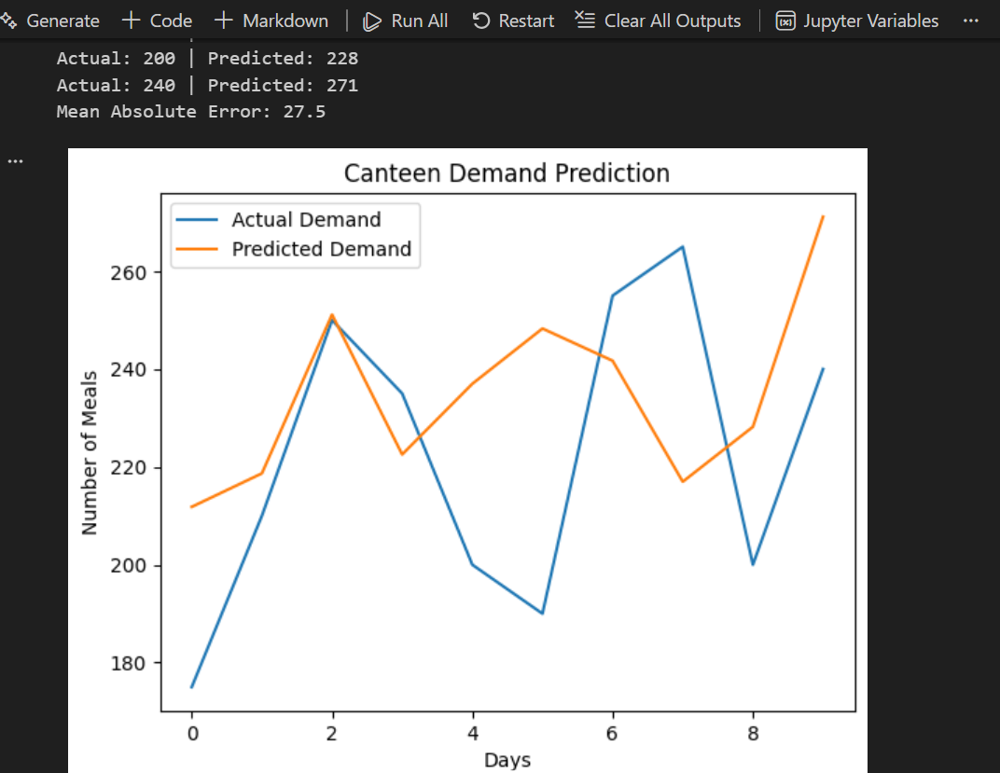

Canteen Demand Predictor

The Canteen Demand Predictor is a beginner-level Python project that predicts the number of meals required in a college canteen on a given day.The prediction is based on simple factors such as the day of the week, exam days, weather conditions, previous day demand, and special events.The goal of this project is to help reduce food wastage and improve planning using basic data analysis and machine learning concepts.

Features

Predicts daily food demand in a canteen
Uses historical data stored in a CSV file
Uses a basic machine learning model
Easy to modify and extend

How to Run

1.Make sure Python 3 is installed on your system.
2.Open the project folder in VS Code.
3.Ensure canteen_data.csv is in the same folder as the notebook.
4.Open canteen_demand_predictor.ipynb.
5.Run the cells one by one using Run All or manually.

Project Structure

VITyarthi-Project/
│
├── canteen_demand_predictor.ipynb
├── canteen_data.csv
├── README.md 
│── /screenshot

Usage

The program reads historical canteen data from the CSV file.
The data is processed and used to train a simple prediction model.
The model predicts food demand for a day.
Predicted values are displayed along with actual values for comparison.

Output 

The output shows:
Predicted canteen demand
Actual demand from the dataset
A comparison graph between actual and predicted values
This helps understand how close the model’s predictions are to real data.

Conclusion

This project demonstrates how basic Python and machine learning techniques can be used to solve real-world problems.
It helped me understand data handling, model training, and prediction while working on a practical and relatable problem.
